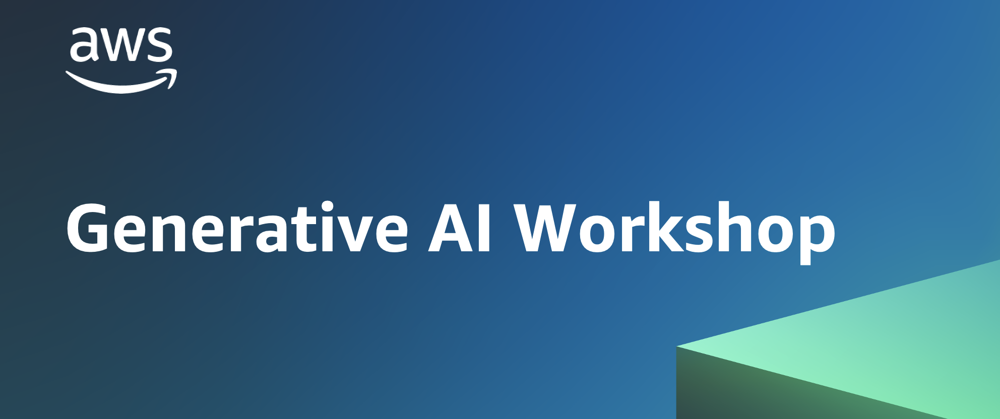

# Immersion Day Generative AI - France 


## Agenda

1. Deploy foundation models using [Amazon Sagemaker Jumpstart](https://aws.amazon.com/sagemaker/jumpstart/?sagemaker-data-wrangler-whats-new.sort-by=item.additionalFields.postDateTime&sagemaker-data-wrangler-whats-new.sort-order=desc)
2. Set up UI with [Streamlit](https://streamlit.io/)
3. Prompt Engineering with [FlanT5-XXL](https://huggingface.co/google/flan-t5-xxl)
4. Use cases for Generative AI with [Falcon7B](https://huggingface.co/tiiuae/falcon-7b)


### Prerequisite:

Make sure you follow this [prerequisite](https://catalog.us-east-1.prod.workshops.aws/workshops/972fd252-36e5-4eed-8608-743e84957f8e/en-US/prerequisites/option1
) before starting the Immersion day


# Lab 1: Deploy foundation models models from Sagemaker Jumpstart 


## **Model 1: FLAN-T5-XXL**

The first example centers around leveraging the ``FLAN-T5-XXL model``, which is a foundation or large language model, to achieve in-context learning for text generation while also addressing a broad range of natural language understanding (NLU) and natural language generation (NLG) tasks. This model has undergone instruction-tuning, implying it has been fine-tuned on more than 2000 NLU tasks and is capable of comprehending  **complex natural language instructions**.

FLAN-T5-XXL is trained on ``1000+ tasks with 11B parameters``  using an ``encoder-decoder`` architecture, hence it can comprehend complex text input and perform tasks such as question answering, topic extraction, commonsense reasoning, or title/context generation.


## Deployment steps :

1.    Open Sagemaker Jumpstart in ``Home tab`` and click on ``Models, Notebook and solutions``,scroll down to ``Text Models`` and select ``FLAN-T5 XXL`` and click on ``View Model``


2.    Click on Deployment Configuration and verify hosting instance is ``ml.g5.12xlarge``, click on ``Deploy``


3.    You should see status below, you will need to wait 10 minutes for the endpoint to be deployed


## **Model 2: Falcon 7B Instruct**


Falcon is a causal ``decoder-only`` model built by [Technology Innovation Institute](https://www.tii.ae/) (TII) and trained on more than ``1 trillion tokens of RefinedWeb`` enhanced with curated corpora. 

A decoder-only model predict next tokens based on previously observed input. It is great for use case such as Text Generation, Question answering or Translation.

It was built using custom-built tooling for data pre-processing and model training built on Amazon SageMaker. As of June 6, 2023, it is the ``best open-source model`` currently available. Falcon-40B outperforms LLaMA, StableLM, RedPajama, MPT, etc. To see comparison, see [OpenLLM Leaderboard](https://huggingface.co/spaces/HuggingFaceH4/open_llm_leaderboard). It features an architecture optimized for inference, with FlashAttention and multiquery.


[Refined Web Dataset](https://huggingface.co/datasets/tiiuae/falcon-refinedweb): Falcon RefinedWeb is a massive English web dataset built by TII and released under an Apache 2.0 license. It is a highly filtered dataset with large scale de-duplication of CommonCrawl. It is observed that models trained on RefinedWeb achieve performance equal to or better than performance achieved by training model on curated datasets, while only relying on web data.
**Model Sizes:**

* ``Falcon-7b``: It is a 7 billion parameter model trained on 1.5 trillion tokens. It outperforms comparable open-source models (e.g., MPT-7B, StableLM, RedPajama etc.). To see comparison, see [OpenLLM Leaderboard](https://huggingface.co/spaces/HuggingFaceH4/open_llm_leaderboard). 
* ``Falcon-40B``: It is a 40 billion parameter model trained on 1 trillion tokens. It has surpassed renowned models like LLaMA-65B, StableLM, RedPajama and MPT on the public leaderboard maintained by Hugging Face, demonstrating its exceptional performance without specialized fine-tuning. To see comparison, see [OpenLLM Leaderboard](https://huggingface.co/spaces/HuggingFaceH4/open_llm_leaderboard).

Instruct models such as ``Falcon-7b-instruct``: Instruct models are base falcon models fine-tuned on a mixture of chat and instruction datasets. They are ready-to-use ``chat/instruct models``.


## Falcon7B vs FlanT5-XXL

| Model | Use case |
| --- | --- |
| `Falcon7B` | Chatbot, Question answering on known topic, Summarization |
| `FlanT5-XXL` | Input extraction (title, topic, ect), Yes/No question answering, Reasonal thinking |


## Deployment steps :

1. Open Sagemaker Jumpstart in ``Home tab`` and click on ``Models, Notebook and solutions``, scroll down to ``Text Models`` and select ``Falcon 7B Instruct BF16`` and click on *``View Model``
2. Deploy model, make sure **hosting endpoint is** `ml.g5.2xlarge`


* * *


# Lab 2: Set Up Streamlit UI

1. Go to [Amazon Sagemaker](https://us-east-1.console.aws.amazon.com/sagemaker/home?region=us-east-1#/endpoints) and copy both ``endpoint’s name`` in a local notepad


2. Open ``Sagemaker studio`` and ``open System Terminal`` using Blue + button on _``top left screen``


3. Clone repository with command below:

```
git clone https://github.com/Pauldevillers/amazon-sagemaker-generativeai
```

4. Go inside the ``studio-playground-ui`` folder, located on ``amazon-sagemaker-generativeai/studio-playground-ui.``


5. Inside templates folder, right click ``Falcon7B-instruct.template.json`` and  ``Open With `` file with ``Editor``


6. **Edit** Falcon7B-instruct.template.json, replace endpoint name with your Sagemaker endpoint’s name saved on step1, don’t forget to SAVE the file, using **CTRL+S**


7. **Repeat same steps** for **FlanT5-XXL-JS.template.json**, open with **Editor** and replace with your Sagemaker endpoint, don’t forget to SAVE the file, using **CTRL+S.**


8. Open ``System Terminal`` using Blue ``+`` button on the top left screen and run command below

```bash
cd amazon-sagemaker-generativeai/studio-playground-ui/
```

```bash
pip install boto3 streamlit streamlit-ace -Uq ai21[SM]
```

```bash
streamlit run main.py
```


9. Open Notebook [Run_My_PlayGround.ipynb](Run_My_PlayGround.ipynb) and** run all cells below Installation Of Streamlit UI. Click on the **HTTPS endpoint** to start the Python User interface. 


# **Lab 3: Prompt Engineering**

#### In the Streamlit UI, select  **FlanT5-XXL-JS** and follow this [tutorial](https://catalog.us-east-1.prod.workshops.aws/workshops/972fd252-36e5-4eed-8608-743e84957f8e/en-US/lab2/zero-shot)


* * *

# Lab 4 : Prompts example for GenAI use case

In the Streamlit UI, select **Falcon7B instruct** and open Notebook [Run_My_PlayGround.ipynb](Run_My_PlayGround.ipynb). You can execute the **Generative AI Prompt example with Falcon** section !


* * *


## 🙇 Author
### Paul Devillers, Prototype Architect France
        
## 🙇 Acknowledgements 
###  Mani Khanuja, AI/ML Specialist Solution Architect

